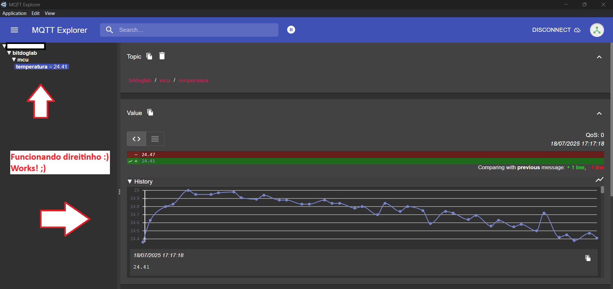
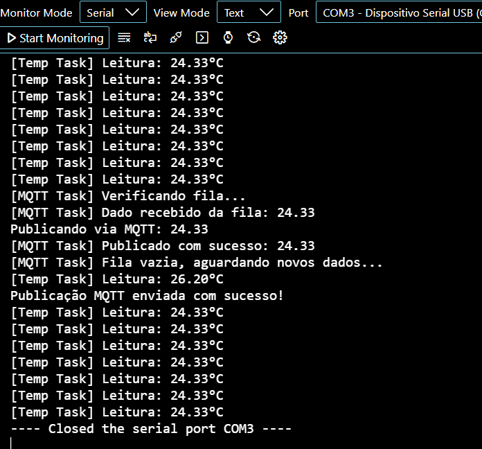


# 📡 Projeto IoT com FreeRTOS e MQTT no Raspberry Pi Pico W (BitDogLab)

Este projeto implementa um sistema embarcado utilizando o **Raspberry Pi Pico W** (na placa **BitDogLab**), baseado em **FreeRTOS**, que lê a temperatura interna do microcontrolador, envia a média via **MQTT** para um broker remoto, e gerencia a conectividade Wi-Fi.

## 🧠 Funcionalidades

- 📶 Conexão Wi-Fi automática com credenciais pré-definidas.
- 🌡️ Leitura periódica da temperatura interna (sensor do RP2040).
- 📊 Cálculo da média de 30 amostras e envio via protocolo MQTT.
- 🟢 Indicação de leitura ativa através de LED.
- 🔁 Filtragem e reenvio de mensagens MQTT em caso de falha.
- 🔄 Implementação multitarefa com **FreeRTOS**.

## 🧱 Estrutura das Tasks

| Task            | Prioridade | Função Principal                                |
|-----------------|------------|--------------------------------------------------|
| `vTemperatureTask` | 1        | Lê e calcula a média da temperatura             |
| `vWifiTask`        | 2        | Gerencia a conexão Wi-Fi                        |
| `vMqttTask`        | 2        | Envia a média de temperatura para o broker MQTT |

## 🔧 Configurações Importantes

### 🔐 Wi-Fi
```c
#define WIFI_SSID "NOME_DA_SUA_REDE_WIFI"
#define WIFI_PASSWORD "SUA_SENHA_DA_REDE"
```

### ☁️ Broker MQTT
```c
#define NOME_DO_DISPOSITIVO "bitdog1ab"
#define IP_DO_BROKER "192.168.0.100"
#define USER_DO_BROKER "SEU_USUARIO_DO_BROKER_MQTT"
#define SENHA_DO_BROKER "SUA_SENHA_DO_BROKER_MQTT"
#define CANAL_DO_BROKER "bitdoglab/mcu/temperatura"
```

> ⚠️ **Atenção:** Estas credenciais são visíveis no código. Em projetos reais, recomenda-se utilizar mecanismos de segurança e criptografia.

## 🛠️ Dependências

- [FreeRTOS para RP2040](https://www.freertos.org)
- [pico-sdk](https://github.com/raspberrypi/pico-sdk)
- [pico-mqtt](https://github.com/MKesenheimer/pico-mqtt)

## 🚀 Como Compilar

1. Instale o [Raspberry Pi Pico SDK](https://github.com/raspberrypi/pico-sdk).
2. Certifique-se de que `cmake`, `make` e `arm-none-eabi-gcc` estão disponíveis no sistema.
3. Clone este repositório e inicialize os submódulos se necessário.
4. Compile com:
   ```bash
   mkdir build
   cd build
   cmake ..
   make
   ```

## 📡 Imagens do código em funcionamento:

Visualização pelo MQTT Explorer...




Saída no serial monitor...




## 🙏 Agradecimentos

- Agradecimento especial ao time da **BitDogLab** pelo excelente trabalho com a biblioteca MQTT para o Pico:  
  🔗 [https://github.com/BitDogLab/BitDogLab-C/tree/main/iot_security_labmqtt]( https://github.com/BitDogLab/BitDogLab-C/tree/main/iot_security_lab)

- Ao time do **FreeRTOS** pelo sistema operacional em tempo real robusto e confiável:  
  🔗 [https://freertos.org](https://freertos.org)

## 📄 Licença

Este projeto é um trabalho educacional e está licenciado sob os termos da licença MIT.

